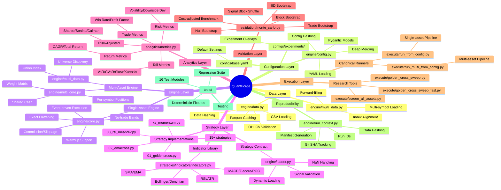
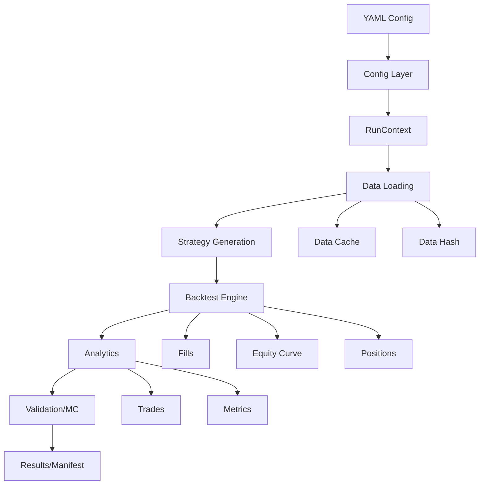

# QuantForge Architecture Documentation

**Generated**: 2026-09-13  
**Project**: QuantForge v0 - Quantitative Trading Backtesting Framework

---

## Table of Contents

1. [Architecture Mindmap](#1-architecture-mindmap)
2. [File-by-File Summary](#2-file-by-file-summary)
3. [How to Run the Project](#3-how-to-run-the-project)
4. [How to Test](#4-how-to-test)
5. [Notable Insights](#5-notable-insights)

---

## 1. Architecture Mindmap



### Data Flow Diagram



---

## 2. File-by-File Summary

### Core Engine Files

#### `engine/data.py`
**Purpose**: Single-file OHLCV data ingestion and validation layer.

**Key Functions**:
- `load_csv(path)`: Load CSV, validate OHLCV, return clean DataFrame
- `cache(df, source_path)`: Write to Parquet, return SHA-256 hash
- `_normalize_columns()`: Handle column aliases (date/timestamp/vol)
- `_validate_ohlc()`: Check OHLC relationships and volume constraints
- `_sort_and_dedupe()`: Remove duplicate timestamps

**Dependencies**: pandas, hashlib  
**Key Features**:
- Required columns: open, high, low, close, volume
- Removes duplicate dates (keeps first occurrence)
- Drops rows violating OHLC sanity
- Validates non-negative volume
- Caches cleaned data as Parquet
- Produces deterministic data fingerprint

**Data Validation Rules**:
- Low ≤ min(open, close)
- High ≥ max(open, close)
- High ≥ Low
- Close > 0
- Volume ≥ 0

---

#### `engine/loader.py`
**Purpose**: Strategy contract enforcement and dynamic loading.

**Key Functions**:
- `load_strategy(path)`: Import .py file and return `generate_signals` function
- `validate_signals(signals, df)`: Validate signal Series against data

**Contract Requirements**:
1. Strategy file must exist with `.py` extension
2. Must define `generate_signals(df)` function
3. Returns pandas Series
4. Series length matches input data
5. Series index equals data index
6. Numeric dtype only
7. Values constrained to [-1, +1]
8. NaN values converted to 0.0

**Dependencies**: importlib, pandas  
**Error Handling**: Raises `StrategyError` with descriptive messages

---

#### `engine/core.py`
**Purpose**: Event-driven single-asset backtesting engine.

**Key Class**: `BacktestEngine`

**Execution Model**:
```
Bar t close → Signal generated
          ↓
Bar t+1 open → Execution
          ↓
Slippage + Commission
          ↓
Position/Cash Update
          ↓
Mark to Market
```

**Parameters**:
- `initial_cash`: Starting portfolio value
- `commission_bps`: Commission in basis points
- `slippage_bps`: Slippage in basis points
- `no_trade_band`: Minimum trade threshold
- `warmup_bars`: Bars to skip at start

**Key Features**:
- Directional slippage (applied in trade direction)
- Commission on notional traded
- No-trade band to reduce churn
- Exact flattening (prevents floating-point dust)
- Fill records with target weights
- Warmup period suppression

**Dependencies**: numpy, pandas, dataclasses

**Invariants Protected**:
- Signal at bar t executes at bar t+1 open
- Final bar signal cannot execute (no t+1)
- Flat target returns exact position to zero

---

#### `engine/multi_core.py`
**Purpose**: Multi-asset event-driven backtesting engine.

**Key Classes**: 
- `MultiAssetBacktestEngine`
- `MultiAssetPortfolio`

**Execution Model**:
- Same as single-asset but across multiple symbols
- Shared cash across all positions
- Per-symbol position tracking
- Weight matrix input (dates × symbols)

**Parameters**:
- `symbols`: List of symbol names
- `allow_short`: Boolean for short positions
- Plus all single-asset parameters

**Key Features**:
- Symbol-aware fills
- Union index across all symbols
- Forward-filled missing prices
- Short restrictions
- Per-symbol warmup handling

**Dependencies**: numpy, pandas

**Current Concern**: Missing-bar tradability semantics need refinement

---

#### `engine/config.py`
**Purpose**: Pydantic-based configuration with validation and hashing.

**Configuration Models**:
- `DataConfig`: path, symbol, start/end dates
- `EngineConfig`: initial_cash, commission_bps, slippage_bps, no_trade_band, warmup_bars
- `StrategyConfig`: path, params dict
- `MonteCarloConfig`: enabled, n_sims, n_perm, block_sizes, seed
- `OutputConfig`: results_dir, run_name, save_manifest
- `AppConfig`: Top-level single-asset config
- `MultiAssetAppConfig`: Multi-asset config
- `XSMomentumConfig`: lookback, skip, top_k, bottom_k, rebalance_freq

**Key Functions**:
- `load_config(path, base_path)`: Load with base overlay
- `config_hash(cfg)`: Deterministic SHA-256 hash
- `_deep_merge(base, overlay)`: Recursive merge

**Dependencies**: pydantic, yaml, hashlib

**Validation**:
- Paths must exist
- Cash > 0
- Commission/slippage ≥ 0
- No-trade band in [0, 1]

---

#### `engine/run_context.py`
**Purpose**: Reproducibility and artifact management.

**Key Class**: `RunContext`

**Manifest Contents**:
- `run_id`: Unique identifier (timestamp + uuid)
- `started_utc`: ISO timestamp
- `git_sha`: Current commit hash
- `git_dirty`: Uncommitted changes flag
- `config_hash`: Configuration fingerprint
- `data_hash`: Data fingerprint
- `python_version`: Runtime version
- `platform`: OS info
- `config`: Full config snapshot
- `results`: Final metrics summary

**Artifact Paths**:
- `manifest.json`: Run metadata
- `equity.csv`: Equity curve
- `fills.csv`: Execution records
- `trades.csv`: Round-trip trades
- `metrics.json`: Performance metrics
- `monte_carlo.json`: MC results

**Dependencies**: json, subprocess, uuid, datetime

---

#### `engine/multi_data.py`
**Purpose**: Multi-symbol data loading and alignment.

**Key Functions**:
- `load_multi_csv(symbol_paths)`: Load multiple CSVs
- `common_index(data)`: Union of all timestamps
- `align_to_index(data, index)`: Reindex to common timeline
- `prepare_multi_data()`: One-call loader
- `discover_symbols(directory)`: Find CSV files

**Alignment Strategy**:
- Uses union index (not intersection)
- Forward-fills OHLC prices
- Sets missing volume to zero
- Preserves different market calendars

**Dependencies**: pandas, engine.data

**Current Issue**: Needs distinction between "price for valuation" vs "tradable bar"

---

### Analytics Layer

#### `analytics/metrics.py`
**Purpose**: Comprehensive performance analytics.

**Metric Categories**:

**Return Metrics**:
- `total_return`: Simple return
- `CAGR`: Compound annual growth rate
- `n_periods`: Number of return observations
- `years`: Elapsed time in years

**Risk Metrics**:
- `volatility`: Annualized std dev
- `downside_deviation`: Downside-only vol
- `max_drawdown`: Peak-to-trough decline
- `avg_drawdown`: Average drawdown
- `drawdown_duration`: Time underwater

**Risk-Adjusted Metrics**:
- `sharpe`: Sharpe ratio
- `sortino`: Sortino ratio
- `calmar`: CAGR / max drawdown

**Tail Metrics**:
- `VaR_95`, `VaR_99`: Value at Risk
- `CVaR_95`, `CVaR_99`: Conditional VaR
- `skew`, `kurtosis`: Distribution shape

**Trade Metrics**:
- `num_trades`: Total trades
- `win_rate`: % profitable trades
- `profit_factor`: Gross wins / gross losses
- `expectancy`: Expected PnL per trade
- `payoff_ratio`: Avg win / avg loss

**Portfolio Metrics**:
- `turnover`: Trading activity rate
- `avg_gross_exposure`: Total |weights|
- `avg_net_exposure`: Sum of weights

**Key Functions**:
- `compute_metrics(equity, rf_annual, periods_per_year, trades)`: Main entry
- `extract_trades(fills)`: Build trade records
- `extract_trades_multi(fills)`: Multi-asset trades

**Calendar-Aware CAGR**: Auto-detects elapsed years from DatetimeIndex

**Dependencies**: numpy, pandas

**Default Issue**: Still uses `TRADING_DAYS = 252` as default

---

### Validation Layer

#### `validation/monte_carlo.py`
**Purpose**: Statistical validation and bootstrap methods.

**Key Functions**:

**`bootstrap_returns_iid(equity, n_sims, seed)`**:
- IID resampling of returns
- Sharpe/CAGR/MaxDD distribution
- P-value calculation

**`bootstrap_returns_block(equity, n_sims, block_size, seed)`**:
- Stationary block bootstrap
- Preserves short-range autocorrelation
- Uses overlapping blocks

**`bootstrap_returns_under_null(equity, n_sims, block_size, seed)`**:
- Centers returns under zero-skill null
- Estimates Sharpe distribution
- One-sided p-value

**`bootstrap_trades(trades, n_sims, seed)`**:
- Resample trades with replacement
- Rebuild equity from trade returns
- Rough Sharpe annualization

**`signal_block_shuffle(df, strategy_fn, block_size, n_sims, seed)`**:
- Shuffle signal blocks
- Preserve signal structure
- Break price alignment

**`same_exposure_benchmark_cost_adjusted(equity, signals, ...)`**:
- Cost-adjusted same-exposure benchmark
- Tests if strategy beats naive exposure

**Dependencies**: numpy, pandas, analytics.metrics, engine.core

**Current Issues**:
1. Hard-coded 21.6-year assumption in trade bootstrap
2. Some functions use default 252 annualization
3. Not consistently timeframe-aware

---

### Strategy Layer

#### `strategies/indicators/indicators.py`
**Purpose**: Shared technical indicator library.

**Indicators Implemented**:
- `sma(series, n)`: Simple moving average
- `ema(series, n)`: Exponential moving average
- `rsi(close, n=14)`: Relative Strength Index (Wilder's smoothing)
- `bollinger(close, n=20, k=2.0)`: Returns (lower, mid, upper)
- `atr(high, low, close, n=14)`: Average True Range (Wilder's)
- `donchian(high, low, n=20)`: Returns (lower, upper)
- `macd(close, fast=12, slow=26, signal=9)`: Returns (line, signal, histogram)
- `zscore(series, n=20)`: Rolling z-score
- `roc(series, n=20)`: Rate of change

**Dependencies**: numpy, pandas

---

#### `strategies/xs_momentum.py`
**Purpose**: Cross-sectional momentum signal generator.

**Key Function**: `cross_sectional_momentum(close_prices, ...)`

**Parameters**:
- `lookback`: Momentum lookback bars (default 252)
- `skip`: Bars to skip near present (default 21)
- `top_k`: Number of longs (default 3)
- `bottom_k`: Number of shorts (default 3)
- `rebalance_freq`: Pandas frequency string (default "MS")
- `long_short`: Enable shorting (default True)
- `gross_exposure`: Total absolute weight (default 1.0)

**Algorithm**:
1. Compute momentum: close[t-skip] / close[t-lookback-skip] - 1
2. Rank symbols by momentum
3. Assign equal weights to top_k longs
4. If long_short: assign equal weights to bottom_k shorts
5. Forward-fill weights between rebalances

**Dependencies**: numpy, pandas

---

#### Strategy Implementations

**`strategies/00_buy_hold.py`**: Buy and hold baseline

**`strategies/01_goldencross.py`**: 
- Fast SMA (50) > Slow SMA (200) → long
- Classic trend-following

**`strategies/02_emacross.py`**:
- Fast EMA / Slow EMA crossover
- More responsive than SMA

**`strategies/03_rsi_meanrev.py`**:
- RSI < 30 → long
- RSI > 70 → short
- Mean reversion

**`strategies/04_bollinger_meanrev.py`**:
- Price < lower band → long
- Price > upper band → short
- Bollinger Band reversion

**`strategies/05_donchian_breakout.py`**:
- Price > Donchian upper → long
- Price < Donchian lower → short
- Trend breakout

**`strategies/06_macd_cross.py`**:
- MACD line crosses above signal → long
- MACD line crosses below signal → short

**`strategies/07_absolute_momentum.py`**:
- Return > 0 → long
- Absolute momentum

**`strategies/08_atr_breakout.py`**:
- Price > previous close + ATR → long
- Volatility-adjusted breakout

**`strategies/09_zscore_meanrev.py`**:
- Z-score < -2 → long
- Z-score > +2 → short
- Statistical arbitrage

**`strategies/10_roc_momentum.py`**:
- ROC > 0 → long
- Rate of change momentum

**`strategies/15_trend_pullback_4h.py`**, **`16_trend_pullback_1h.py`**:
- Trend pullback strategies
- Different timeframes

**`strategies/17_ny_orb_breakout.py`** - **`23_ny_orb_atr_regime.py`**:
- NY Opening Range Breakout variations
- Multiple ORB formulations

---

### Execution Layer

#### `execute/run_from_config.py`
**Purpose**: Canonical single-asset pipeline runner.

**Usage**:
```bash
python -m execute.run_from_config configs/experiments/gold_abs_momentum.yaml
python -m execute.run_from_config <exp.yaml> --no-mc
```

**Pipeline**:
1. Load + validate config (with base overlay)
2. Create RunContext (unique run_id, manifest)
3. Load data (load_csv + cache + hash)
4. Load + validate strategy
5. Run BacktestEngine
6. Extract trades
7. Compute metrics
8. Run Monte Carlo (optional)
9. Write artifacts + manifest

**Output**:
- `results/runs/<run_id>/manifest.json`
- `results/runs/<run_id>/equity.csv`
- `results/runs/<run_id>/trades.csv`
- `results/runs/<run_id>/fills.csv`
- `results/runs/<run_id>/metrics.json`
- `results/runs/<run_id>/monte_carlo.json`

**Dependencies**: All core modules

---

#### `execute/run_multi_from_config.py`
**Purpose**: Canonical multi-asset pipeline runner.

**Usage**:
```bash
python -m execute.run_multi_from_config configs/experiments/xs_momentum_daily.yaml
```

**Pipeline**:
1. Load multi-asset config
2. Create RunContext
3. Discover symbols from directory
4. Load + align multi-asset data
5. Generate XS momentum signals
6. Run MultiAssetBacktestEngine
7. Compute equal-weight benchmark
8. Extract multi-asset trades
9. Compute metrics + exposures
10. Run Monte Carlo (optional)
11. Write artifacts + manifest

**Benchmark**: Equal-weight monthly-rebalanced buy-and-hold

**Dependencies**: Multi-asset modules, xs_momentum

---

#### `execute/golden_cross_sweep.py`
**Purpose**: Full parameter sweep for Golden Cross strategy.

**Parameters Tested**:
- Fast SMA periods
- Slow SMA periods
- Long-only vs long/short
- Confirmation filters
- Crossover buffers

**Method**: Runs every variant through actual BacktestEngine

**Timeframe-aware**: Computes periods_per_year from data

---

#### `execute/golden_cross_sweep_fast.py`
**Purpose**: Fast two-stage Golden Cross sweep.

**Architecture**:
```
~2,960 variants
      ↓
Stage 1: Vectorized screening
      ↓
Rank candidates
      ↓
Stage 2: Top-N → Full BacktestEngine
```

**Default**: Top 10 candidates, min 10 approximate events

**Important**: Stage 1 is approximation only, not final truth

---

#### `execute/screen_all_assets.py`
**Purpose**: Run multiple strategies across multiple assets.

**Output**: `results/screen_all_assets.csv`

---

### Configuration Files

#### `configs/base.yaml`
**Default Configuration**:
```yaml
data:
  path: data/raw/daily/xauusd_1D_comma.csv
  symbol: XAUUSD
  
engine:
  initial_cash: 100000.0
  commission_bps: 1.0
  slippage_bps: 5.0
  no_trade_band: 0.01
  warmup_bars: 0
  
strategy:
  path: strategies/07_absolute_momentum.py
  
monte_carlo:
  enabled: true
  n_sims: 5000
  n_perm: 500
  seed: 42
  
output:
  results_dir: results
  save_manifest: true
```

---

#### Experiment Configs

**`configs/experiments/gold_abs_momentum.yaml`**: Gold absolute momentum

**`configs/experiments/gold_goldencross.yaml`**: Gold Golden Cross

**`configs/experiments/xs_momentum_14assets.yaml`**: 
- 252 lookback
- 21 skip
- Top/bottom 3
- Monthly rebalance
- Long/short enabled
- 273 warmup bars

**`configs/experiments/xs_momentum_daily.yaml`**:
- Discovers daily CSV files
- Monte Carlo enabled

---

### Test Files

#### Test Suite Overview

**16 Test Modules**:
1. `test_config.py` - Configuration loading and validation
2. `test_data.py` - Data loading and OHLCV validation
3. `test_engine.py` - Single-asset engine execution
4. `test_engine_warmup.py` - Warmup period behavior
5. `test_loader.py` - Strategy contract enforcement
6. `test_metrics.py` - Analytics calculations
7. `test_metrics_cagr.py` - Calendar-aware CAGR
8. `test_montecarlo.py` - MC bootstrap methods
9. `test_montecarlo_cost_adj.py` - Cost-adjusted benchmark
10. `test_multi_engine.py` - Multi-asset execution
11. `test_run_context.py` - Reproducibility/manifests
12. `test_xs_momentum.py` - Cross-sectional momentum
13. `test_ny_orb_variations.py` - ORB strategies
14. `test_orb_signal_audit.py` - ORB signal validation
15. `conftest.py` - Fixtures and test config
16. `tests/fixtures/generate.py` - Deterministic fixtures

---

#### `tests/conftest.py`
**Purpose**: Pytest configuration and fixtures.

**Fixtures**:
- Auto-generates test fixtures if missing
- Uses deterministic data generation
- Provides paths to test CSVs

---

#### `tests/fixtures/generate.py`
**Purpose**: Generate deterministic test fixtures.

**Fixtures Created**:
- `valid_ohlc.csv`: Clean OHLCV data
- `bad_ohlc.csv`: Invalid OHLC relationships
- `dupes.csv`: Duplicate timestamps
- `missing_column.csv`: Missing required columns

**Idempotent**: Can be run multiple times safely

---

### Documentation Files

#### `docs/context/state.md`
**Purpose**: Current project state and handoff document.

**Contents**:
- Milestone status (0-5 complete)
- Tier progress (1-2)
- Data organization
- Engine state (single/multi-asset)
- Strategy research outcomes
- Known issues and gaps
- Next steps

**Key Insight**: Project is in transition from "working research framework" to "research-grade, internally consistent framework"

---

#### `docs/context/architecture.md`
**Purpose**: Architecture-level documentation.

**Contents**:
- Layered component overview
- Execution invariants
- Strategy contract
- Data flow
- Configuration system
- Known architecture gaps

---

## 3. How to Run the Project

### Setup

**Environment**:
```bash
# Python 3.11 required
python --version

# Create virtual environment
python -m venv .venv
source .venv/bin/activate  # Linux/Mac
# or
.venv\Scripts\activate     # Windows

# Install dependencies
pip install pandas numpy pyarrow scipy pydantic PyYAML statsmodels pytest
```

**Dependencies**:
- pandas - Data manipulation
- numpy - Numerical operations
- pyarrow - Parquet support
- scipy - Statistical functions
- pydantic - Configuration validation
- PyYAML - YAML parsing
- statsmodels - Statistical models
- pytest - Testing

### Single-Asset Runs

**Basic Run**:
```bash
python -m execute.run_from_config configs/experiments/gold_abs_momentum.yaml
```

**Skip Monte Carlo** (faster):
```bash
python -m execute.run_from_config configs/experiments/gold_abs_momentum.yaml --no-mc
```

**Output Location**: `results/runs/<run_id>/`

**Output Files**:
- `manifest.json` - Run metadata
- `equity.csv` - Equity curve
- `trades.csv` - Round-trip trades
- `fills.csv` - Execution records
- `metrics.json` - Performance metrics
- `monte_carlo.json` - MC results

### Multi-Asset Runs

**Basic Run**:
```bash
python -m execute.run_multi_from_config configs/experiments/xs_momentum_daily.yaml
```

**Requirements**:
- Multiple CSV files in data directory
- Each file: `<symbol>.csv`
- OHLCV format required

**Output**: Same as single-asset, plus:
- Multi-symbol fills
- Portfolio-level metrics
- Benchmark comparison

### Research Tools

**Golden Cross Sweep** (full):
```bash
python -m execute.golden_cross_sweep
```

**Golden Cross Sweep** (fast):
```bash
python -m execute.golden_cross_sweep_fast
```

**Screen All Assets**:
```bash
python -m execute.screen_all_assets
```

### Data Requirements

**Required CSV Columns**:
- `date` or `datetime` or `timestamp` - Timestamp
- `open` - Open price
- `high` - High price
- `low` - Low price
- `close` - Close price
- `volume` - Volume

**Supported Aliases**:
- `vol` → `volume`
- `adj close` → `adj_close`

**Data Directories**:
- `data/raw/daily/` - Daily data
- `data/raw/fourhours/` - 4-hour data
- `data/raw/onehours/` - 1-hour data
- `data/cache/` - Parquet cache

### Configuration

**Create Custom Experiment**:
```yaml
# configs/experiments/my_experiment.yaml
data:
  path: data/raw/daily/my_asset.csv
  symbol: MY_ASSET

strategy:
  path: strategies/01_goldencross.py
  
engine:
  initial_cash: 50000
  commission_bps: 2.0
  
monte_carlo:
  enabled: true
  n_sims: 10000
```

**Run**:
```bash
python -m execute.run_from_config configs/experiments/my_experiment.yaml
```

---

## 4. How to Test

### Test Suite

**Run All Tests**:
```bash
pytest
```

**Run with Verbosity**:
```bash
pytest -v
```

**Run Specific Module**:
```bash
pytest tests/test_engine.py
```

**Run Specific Test**:
```bash
pytest tests/test_engine.py::test_long_position_accounting
```

### Test Coverage

**Core Invariants Tested**:

**Execution**:
- Signal at bar t executes at bar t+1 open
- Final bar signal does not execute
- Transaction costs reduce returns
- Flat target returns position to exactly zero
- Equity curve length matches data
- Deterministic outputs for same inputs

**Strategy Contract**:
- Invalid file paths rejected
- Non-Python files rejected
- Missing `generate_signals` rejected
- Non-Series return types rejected
- Length/index mismatches rejected
- Out-of-range values rejected
- NaN values converted to zero

**Data Validation**:
- OHLC relationships enforced
- Duplicate dates removed
- Missing columns raise errors
- Data hashing deterministic

**Analytics**:
- Calendar-aware CAGR
- Sharpe calculation correct
- Drawdown calculation correct
- Trade extraction handles flips

**Monte Carlo**:
- Deterministic for fixed seed
- Null bootstrap centers correctly
- P-values in valid range
- CI ordering correct
- Cost-adjusted benchmark preserves exposure

**Multi-Asset**:
- Per-symbol positions correct
- Shared cash accounting
- Short restrictions work
- Symbol-aware fills

### Test Fixtures

**Location**: `tests/fixtures/`

**Generated Files**:
- `valid_ohlc.csv` - 100 bars of clean data
- `bad_ohlc.csv` - Invalid OHLC relationships
- `dupes.csv` - Duplicate timestamps
- `missing_column.csv` - Missing 'close' column

**Regenerate Fixtures**:
```bash
python -m tests.fixtures.generate
```

### Expected Test Count

Run `pytest -v` to get current exact count. As of latest check: **64+ passing tests** across 16 modules.

### Test Organization

```
tests/
├── __init__.py
├── conftest.py              # Fixtures and config
├── fixtures/
│   ├── __init__.py
│   └── generate.py          # Fixture generation
├── test_config.py           # Config loading
├── test_data.py             # Data validation
├── test_engine.py           # Single-asset engine
├── test_engine_warmup.py    # Warmup behavior
├── test_loader.py           # Strategy contract
├── test_metrics.py          # Analytics
├── test_metrics_cagr.py     # Calendar CAGR
├── test_montecarlo.py       # MC methods
├── test_montecarlo_cost_adj.py  # Cost-adjusted benchmark
├── test_multi_engine.py     # Multi-asset engine
├── test_run_context.py      # Reproducibility
├── test_xs_momentum.py      # Cross-sectional momentum
├── test_ny_orb_variations.py    # ORB strategies
└── test_orb_signal_audit.py     # ORB validation
```

---

## 5. Notable Insights

### Architectural Patterns

**1. Event-Driven Execution**
- Signal at bar t close → Execute at bar t+1 open
- Prevents look-ahead bias
- Realistic execution modeling

**2. Separation of Concerns**
- Strategies produce **target signals**
- Engines handle **execution**
- Analytics measure **performance**
- Validation tests **skill vs luck**

**3. Deterministic Reproducibility**
- Config hashes
- Data hashes
- Git SHA tracking
- Seeded random operations

**4. Contract-Based Strategy Interface**
- Strict validation of signal Series
- Enforces [-1, +1] weight constraints
- NaN handling standardized

**5. Multi-Layer Validation**
- Data validation (OHLCV)
- Strategy validation (contract)
- Execution validation (engine invariants)
- Performance validation (Monte Carlo)

### Architectural Strengths

**1. Robust Testing Foundation**
- 64+ regression tests
- Deterministic fixtures
- Clear invariants protected

**2. Production-Grade Data Handling**
- Comprehensive validation
- Caching for performance
- Deterministic hashing

**3. Realistic Execution Model**
- Slippage in trade direction
- Commission on notional
- No-trade bands
- Exact flattening

**4. Reproducible Research**
- Full manifest tracking
- Config overlays
- Git integration
- Unique run IDs

**5. Multi-Asset Capability**
- Per-symbol positions
- Shared cash
- Cross-sectional signals
- Portfolio analytics

### Known Issues and Gaps

**P0 - High Priority**:

1. **Inconsistent Annualization**
   - MC functions not all timeframe-aware
   - Default 252 assumption persists
   - Trade bootstrap hard-codes 21.6 years
   - **Fix**: Propagate `periods_per_year` consistently

2. **Strategy Parameter Gap**
   - Config has `strategy.params` field
   - Canonical runner doesn't pass to strategy
   - Parameters not wired into execution
   - **Fix**: Update `run_from_config.py` to pass params

3. **Multi-Asset Data Hash**
   - Single-asset runs record data hash
   - Multi-asset runs don't compute universe hash
   - **Fix**: Add multi-asset data hash to manifest

4. **Benchmark Inconsistency**
   - Multiple benchmark implementations
   - Not all cost-adjusted
   - **Fix**: Standardize cost-adjusted benchmark API

5. **Tradability Semantics**
   - Multi-asset forward-fills prices
   - No distinction between "price exists" vs "tradable"
   - **Fix**: Add session/tradability model

**P1 - Medium Priority**:

6. **Default Annualization**
   - `TRADING_DAYS = 252` default in metrics
   - Easy to misuse for intraday
   - **Fix**: Make timeframe explicit, remove default

7. **Legacy Execution Scripts**
   - `execute/` has accumulated research scripts
   - Not all canonical
   - **Fix**: Classify or retire

8. **Broad Exception Assertions**
   - Some tests catch generic `Exception`
   - **Fix**: Tighten to specific exceptions

9. **Hard-coded Costs in Research Scripts**
   - Some scripts don't use config costs
   - **Fix**: Standardize through config

10. **Multi-Asset Session Tests**
    - No tests for asynchronous sessions
    - **Fix**: Add timezone/session tests

### Research Insights

**Rejected Hypotheses**:
- Donchian + ADX refinements - unconvincing
- Orion-style oscillator combinations - weak
- Trend-pullback multi-indicator - rejected

**Strongest Current Hypothesis**: Golden Cross
- Strong in equity indices
- Parameter neighborhoods (not isolated optima)
- Long-only better in equities
- Long/short strong but high-drawdown in commodities

**Cross-Sectional Momentum**: Interesting but not validated
- 12-14 assets may be too small universe
- Long/short leg may be inappropriate in bullish sample
- Did not beat equal-weight benchmark

**Key Process Lessons**:
1. Don't blindly optimize bad hypotheses
2. Separate screening from validation
3. Parameter neighborhoods > isolated winners
4. More trades ≠ more edge
5. Execution assumptions matter

### Code Quality Observations

**Strengths**:
- Clean separation of concerns
- Type hints used consistently
- Docstrings on key functions
- Pydantic for validation
- Comprehensive test coverage

**Areas for Improvement**:
- Large commented historical code (data.py)
- Inconsistent error messages
- Some magic numbers (e.g., 1e-9 dust threshold)
- Hard-coded values in research scripts
- Missing docstrings in some modules

### Performance Considerations

**Bottlenecks**:
- Full Golden Cross sweep: slow (all engine calls)
- Monte Carlo with many simulations
- Multi-asset with large universes

**Optimizations**:
- Fast sweep: vectorized Stage 1 screening
- Parquet caching for cleaned data
- Block bootstrap for autocorrelation preservation

**Future Optimizations**:
- Parallel Monte Carlo simulations
- Incremental signal computation
- Database-backed data layer

### Recommended Next Steps

**Immediate (Before Adding Features)**:

1. Fix MC annualization consistency
2. Wire strategy.params to execution
3. Add multi-asset data hash
4. Standardize benchmark API
5. Resolve tradability semantics

**Foundation Hardening**:
1. Add timeframe-aware MC tests
2. Add intraday timezone tests
3. Tighten exception assertions
4. Classify legacy scripts
5. Remove commented code

**Research Roadmap** (Deferred):
1. MC consistency
2. Benchmark consistency
3. Golden Cross robustness
4. Out-of-sample validation
5. Walk-forward validation
6. White's Reality Check
7. Deflated Sharpe
8. Purged cross-validation
9. Systematic optimization (Optuna)

### Dead Code / Legacy

**Commented Historical Implementations**:
- `engine/data.py`: NIFTY/OHLC-only loader (lines 87-315)
- Earlier data loader without volume requirement

**Legacy Scripts** (Needs Classification):
- `execute/execute_all.py`
- `execute/execute_runner.py`
- `execute/execute_montecarlo.py`
- `execute/researcher_workflow.py`

**Deleted Files** (git status shows):
- `data/raw/toy.csv`
- `data/raw/toy_with_errors.csv`
- `data/raw/toy_with_ohlcv_errors.csv`
- `strategies/indicators.py` (moved to `strategies/indicators/indicators.py`)

### TODOs and Future Work

**From Code Comments**:
1. "in production, compute from trade timestamps" (monte_carlo.py:110)
2. Needs stronger distinction between valuation price vs tradability
3. Multi-asset benchmark needs cost adjustment
4. Strategy parameter wiring incomplete

**From Documentation**:
1. White's Reality Check - not implemented
2. Walk-forward validation - not implemented
3. Purged CV - deferred
4. Deflated Sharpe - deferred
5. Optuna integration - deferred

### Key Metrics and Statistics

**Codebase Size**:
- ~75 Python files (excluding .venv)
- ~20 strategy implementations
- 16 test modules
- 64+ passing tests
- 5 config files

**Data Universe**:
- Daily, 4H, 1H timeframes
- 12-14 assets per universe
- Assets: XAUUSD, XAGUSD, BRENT, EURUSD, GBPUSD, USDCAD, USDCHF, USDJPY, DAX, US30, S&P500, US Tech, GBR index, DEU index

**Project Maturity**:
- Milestones 0-5: Complete ✅
- Tier 1: Substantially complete
- Tier 2: In progress
- Status: Research-grade hardening phase

---

## Summary

QuantForge is a sophisticated event-driven backtesting framework designed for rigorous quantitative research. It combines:

- **Robust data validation** with caching and hashing
- **Realistic execution modeling** with slippage, commission, and no-trade bands
- **Comprehensive analytics** covering returns, risk, and trade metrics
- **Statistical validation** through multiple Monte Carlo methods
- **Reproducible research** with manifest tracking and git integration
- **Multi-asset capability** for portfolio-level strategies

The codebase is well-structured with clear separation of concerns and strong test coverage. The main focus now is **hardening the research infrastructure** for consistency and robustness before adding advanced validation methods.

The strongest research hypothesis currently is **Golden Cross** on equity indices, while cross-sectional momentum shows promise but requires a larger universe and more validation.

**Critical Next Steps**: Fix annualization inconsistencies, wire strategy parameters, standardize benchmarks, and complete multi-asset data hashing before proceeding to advanced validation techniques.
