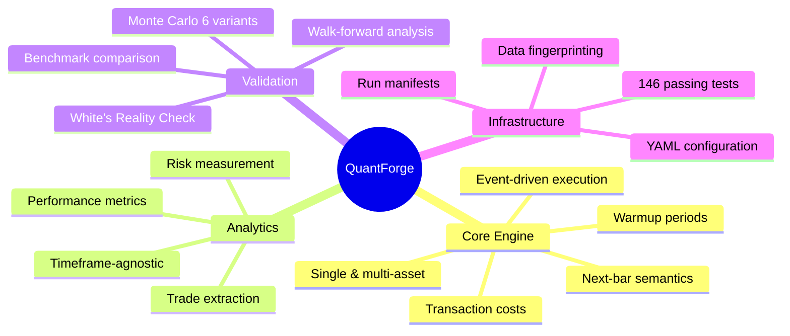
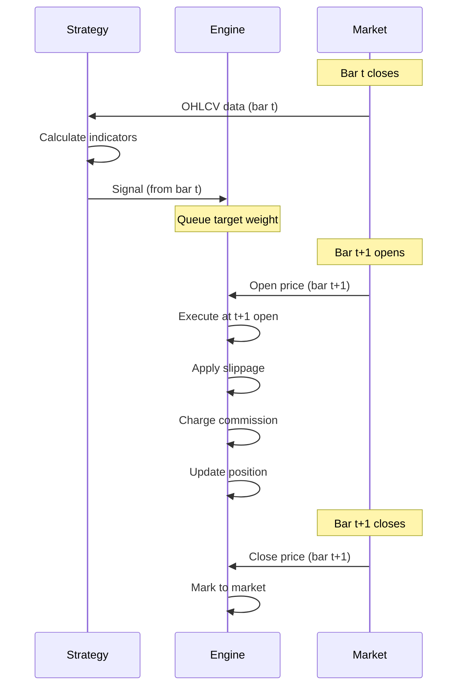
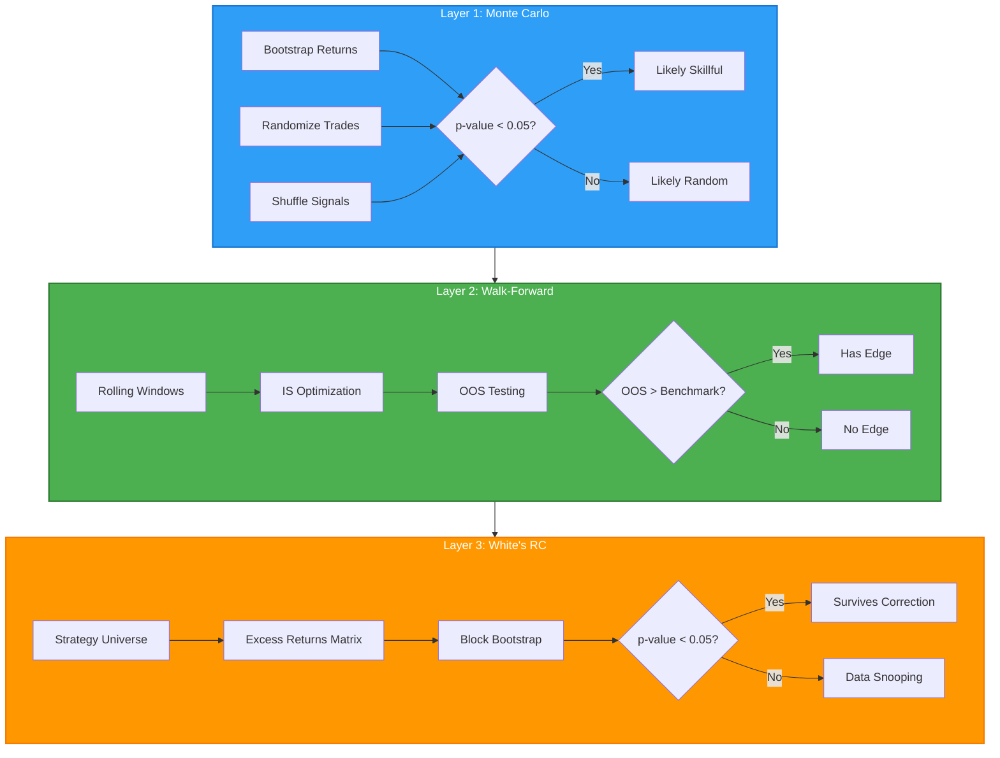
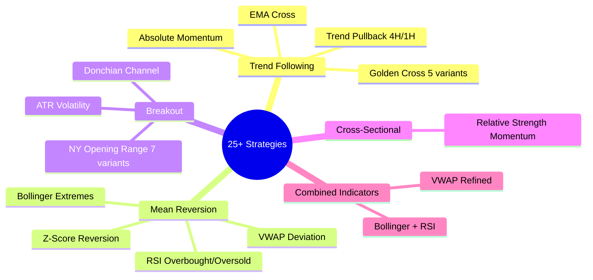
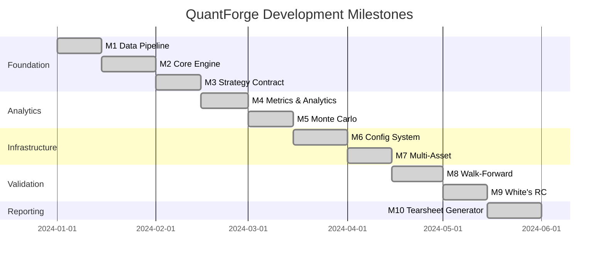

<div align="center">


### Research-Grade Backtesting Framework with Complete Statistical Validation

<p align="center">
  
</p>

<p align="center">
  
  
  
  
  
</p>

<p align="center">
  <a href="#-key-features">Features</a> •
  <a href="#-quick-start">Quick Start</a> •
  <a href="#-architecture">Architecture</a> •
  <a href="#-validation">Validation</a> •
  <a href="#-documentation">Docs</a> •
  <a href="#-milestones">Milestones</a>
</p>

---

</div>

## 🎯 What is QuantForge?

<table>
<tr>
<td width="60%">

**QuantForge** is a research-oriented quantitative backtesting framework designed to **separate signal from noise** in trading strategy research.

Built to prevent the common pitfalls of:
- ❌ **Overfitting** to historical data
- ❌ **Data snooping** bias from multiple testing  
- ❌ **Look-ahead bias** in signal generation
- ❌ **Survivorship bias** in asset selection

It provides a **complete validation stack** that distinguishes skill-based strategies from random chance through rigorous statistical testing.

</td>
<td width="40%">

```python
# Simple Strategy Example
def generate_signals(df):
    fast = df['close'].ewm(50).mean()
    slow = df['close'].ewm(200).mean()
    
    signals = pd.Series(0, index=df.index)
    signals[fast > slow] = 1.0   # Long
    signals[fast < slow] = -1.0  # Short
    
    return signals
```

</td>
</tr>
</table>

---

## ✨ Key Features

<div align="center">



</div>

<table>
<tr>
<td width="50%" valign="top">

### 🏗️ **Core Architecture**


- ✅ Event-driven execution engine with **next-bar semantics**
- ✅ **Single-asset & multi-asset** portfolio support
- ✅ **Cross-sectional strategies** with weight-based signals
- ✅ **Transaction costs** (commission + slippage)
- ✅ **Warmup periods** for indicator initialization
- ✅ **Exact position flattening** (no floating-point dust)

</td>
<td width="50%" valign="top">

### 📊 **Analytics Layer**


- ✅ **Performance**: CAGR, Sharpe, Sortino, Calmar
- ✅ **Risk**: Volatility, drawdowns, VaR, CVaR
- ✅ **Distribution**: Skew, kurtosis, tail risk
- ✅ **Trade-level**: Win rate, profit factor, expectancy
- ✅ **Timeframe-agnostic** (daily, 4H, 1H auto-detection)

</td>
</tr>
<tr>
<td width="50%" valign="top">

### 🔬 **Validation Stack**


- ✅ **Monte Carlo** (6 variants: IID, block, null, trade, signal-shuffle)
- ✅ **Walk-forward** validation with benchmark comparison
- ✅ **White's Reality Check** for multiple-testing correction
- ✅ **Same-exposure benchmark** (honest performance attribution)
- ✅ **Chained OOS equity** for low-turnover strategies

</td>
<td width="50%" valign="top">

### ⚙️ **Research Infrastructure**


- ✅ **Typed YAML configuration** with Pydantic validation
- ✅ **Run manifests** for reproducibility
- ✅ **Data fingerprinting** (SHA-256 hashing)
- ✅ **Git integration** for version tracking
- ✅ **Canonical artifact structure**
- ✅ **146 passing tests** with full regression coverage

</td>
</tr>
</table>

---

## 🚀 Quick Start

<div align="center">


</div>

### Installation

```bash
# Clone the repository
git clone https://github.com/Abhidev-aiml/quantforge-v0.git
cd quantforge-v0

# Create virtual environment
python3.11 -m venv .venv
source .venv/bin/activate  # On Windows: .venv\Scripts\activate

# Install dependencies
pip install -r requirements.txt

# Verify installation (should show 146 passing tests)
python -m pytest -v
```

### Run Your First Backtest

<table>
<tr>
<td width="50%">

**Single-Asset Backtest**
```bash
python -m execute.run_from_config \
  configs/experiments/gold_goldencross.yaml
```

**Walk-Forward Validation**
```bash
python -m execute.run_walk_forward \
  configs/experiments/gold_goldencross_wf.yaml
```

</td>
<td width="50%">

**Multi-Asset Portfolio**
```bash
python -m execute.run_multi_from_config \
  configs/experiments/xs_momentum_14assets.yaml
```

**White's Reality Check**
```bash
python -m execute.run_whites_rc
```

</td>
</tr>
</table>

---

## 📐 Architecture Overview

```mermaid
flowchart TB
    subgraph Input["📥 Input Layer"]
        A1[YAML Config]
        A2[Market Data CSV]
    end
    
    subgraph Config["⚙️ Configuration Layer"]
        B1[Schema Validation]
        B2[Type Safety]
        B3[Data Hashing]
    end
    
    subgraph Strategy["🎯 Strategy Layer"]
        C1[Signal Generation]
        C2[Contract Validation]
        C3[Parameter Wiring]
    end
    
    subgraph Engine["🏗️ Engine Layer"]
        D1[Event-Driven Execution]
        D2[Transaction Costs]
        D3[Position Management]
    end
    
    subgraph Analytics["📊 Analytics Layer"]
        E1[Performance Metrics]
        E2[Risk Measurement]
        E3[Trade Extraction]
    end
    
    subgraph Validation["🔬 Validation Layer"]
        F1[Monte Carlo]
        F2[Walk-Forward]
        F3[White's RC]
    end
    
    subgraph Output["📤 Output Layer"]
        G1[Run Artifacts]
        G2[HTML Tearsheet]
        G3[Interactive Charts]
    end
    
    Input --> Config
    Config --> Strategy
    Strategy --> Engine
    Engine --> Analytics
    Analytics --> Validation
    Validation --> Output
    
    style Input fill:#2E9EF7,stroke:#1976D2,stroke-width:2px,color:#fff
    style Config fill:#4CAF50,stroke:#2E7D32,stroke-width:2px,color:#fff
    style Strategy fill:#FF9800,stroke:#F57C00,stroke-width:2px,color:#fff
    style Engine fill:#9C27B0,stroke:#6A1B9A,stroke-width:2px,color:#fff
    style Analytics fill:#E91E63,stroke:#C2185B,stroke-width:2px,color:#fff
    style Validation fill:#00BCD4,stroke:#0097A7,stroke-width:2px,color:#fff
    style Output fill:#795548,stroke:#5D4037,stroke-width:2px,color:#fff
```

<div align="center">



</div>

### Execution Semantics

<table>
<tr>
<td width="50%">



</td>
<td width="50%">

### Key Principles

**Next-Bar Execution**
```
Bar t close → Signal → Queue → Execute at t+1 open
```

**No Look-Ahead**
- Future data never influences past decisions
- Signal from bar `t` executes at bar `t+1`
- Last bar signal cannot execute

**Transaction Costs**
- Directional slippage (against trade)
- Commission on notional value
- No-trade bands to reduce churn

**Deterministic**
- Fixed seed → identical results
- SHA-256 data fingerprinting
- Run manifest for reproducibility

</td>
</tr>
</table>

---

## 🔬 Validation Methodology

<div align="center">



</div>

### 1️⃣ Monte Carlo Simulation

<table>
<tr>
<td width="40%">

**Purpose**: Test if observed performance could be random chance

**Methods**:
- 🔄 **IID Bootstrap**: Resample returns with replacement
- 📦 **Block Bootstrap**: Preserve autocorrelation
- 🎲 **Null Bootstrap**: Test zero-mean hypothesis
- 🔀 **Trade Bootstrap**: Randomize trade outcomes
- 🎰 **Signal Shuffle**: Randomize entry/exit timing

</td>
<td width="60%">

```python
from validation.monte_carlo import bootstrap_returns_iid

# Run Monte Carlo simulation
results = bootstrap_returns_iid(
    equity=equity_curve,
    n_sims=5000,
    periods_per_year=252,
    seed=42
)

print(f"p-value: {results['p_value']:.4f}")
print(f"Percentile: {results['percentile']:.1f}%")

# Verdict: p < 0.05 suggests skill-based performance
```

</td>
</tr>
</table>

### 2️⃣ Walk-Forward Validation

```mermaid
gantt
    title Walk-Forward Windows (Train → Test)
    dateFormat X
    axisFormat %s
    
    section Window 1
    Train :active, w1t, 0, 252
    Test  :crit, w1o, 252, 63
    
    section Window 2
    Train :active, w2t, 21, 252
    Test  :crit, w2o, 273, 63
    
    section Window 3
    Train :active, w3t, 42, 252
    Test  :crit, w3o, 294, 63
    
    section Window 4
    Train :active, w4t, 63, 252
    Test  :crit, w4o, 315, 63
```

<div align="center">



</div>

<table>
<tr>
<td width="50%">

**Purpose**: Prevent look-ahead bias and overfitting

**Process**:
1. Split data into rolling windows
2. Optimize parameters on in-sample (IS)
3. Test on out-of-sample (OOS)
4. Compare OOS vs same-exposure benchmark
5. Chain OOS periods for statistical power

</td>
<td width="50%">

```python
from validation.walk_forward import walk_forward

# Run walk-forward validation
wf_results = walk_forward(
    data=df,
    strategy_fn=generate_signals,
    train_bars=252,  # 1 year
    test_bars=63,    # 3 months
    step_bars=21     # 1 month
)

# Verdicts
print(f"Robust: {wf_results['robust']}")
print(f"Has Edge: {wf_results['has_edge']}")
```

</td>
</tr>
</table>

### 3️⃣ White's Reality Check

<table>
<tr>
<td width="50%">

**Problem**: Testing 100 strategies → ~99% chance of false positive

**Solution**: Multiple-testing correction via bootstrap

**Process**:
1. Build (T, K) excess-return matrix
2. Find best performer across K strategies
3. Bootstrap under null hypothesis
4. Compute corrected p-value

</td>
<td width="50%">

```python
from validation.whites_reality_check import whites_reality_check

# Run White's Reality Check
wrc_results = whites_reality_check(
    excess_returns_matrix,  # (T, K) array
    n_bootstrap=5000,
    block_length=10,
    seed=42
)

print(f"Best Strategy: {wrc_results['best_combo']}")
print(f"p-value: {wrc_results['p_value']:.4f}")

# Verdict: p < 0.05 survives multiple-testing correction
```

</td>
</tr>
</table>

---

## 📊 Strategy Library

<div align="center">



</div>

<table>
<tr>
<td width="50%">

### Trend Following
- `01_goldencross.py` - SMA/EMA crossover (5 variants)
- `02_emacross.py` - EMA crossover
- `07_absolute_momentum.py` - Time-series momentum
- `15_trend_pullback_4h.py` - 4H trend + pullback
- `16_trend_pullback_1h.py` - 1H trend + pullback

### Mean Reversion
- `03_rsi_meanrev.py` - RSI overbought/oversold
- `04_bollinger_meanrev.py` - Bollinger extremes
- `09_zscore_meanrev.py` - Z-score reversion
- `24_vwap_reversion.py` - VWAP deviation

</td>
<td width="50%">

### Breakout
- `05_donchian_breakout.py` - Donchian channel
- `08_atr_breakout.py` - ATR volatility
- `17-23_ny_orb_*.py` - NY ORB (7 variants)

### Cross-Sectional
- `xs_momentum.py` - Relative strength ranking

### Combined Indicators
- `25_bollinger_rsi_double.py` - Bollinger + RSI
- `25_vwap_refined.py` - Enhanced VWAP

</td>
</tr>
</table>

---

## 📈 Milestone Progress

<div align="center">



</div>

| Milestone | Component | Status | Files |
|-----------|-----------|--------|-------|
| **M1** | Data Pipeline |  | `engine/data.py` |
| **M2** | Core Backtesting Engine |  | `engine/core.py` |
| **M3** | Strategy Contract |  | `engine/loader.py` |
| **M4** | Analytics & Metrics |  | `analytics/metrics.py` |
| **M5** | Monte Carlo Simulation |  | `validation/monte_carlo.py` |
| **M6** | Config System & Execution |  | `engine/config.py`, `run_context.py` |
| **M7** | Multi-Asset Execution |  | `engine/multi_core.py`, `multi_data.py` |
| **M8** | Walk-Forward Validation |  | `validation/walk_forward.py` |
| **M9** | White's Reality Check |  | `validation/whites_reality_check.py` |
| **M10** | Reporting & Tearsheet |  | `reporting/tearsheet.py` |


See **[docs/milestones/](docs/milestones/)** for detailed documentation of each milestone.

---

## 🧪 Testing Coverage

<div align="center">


</div>

```bash
# Run all tests
python -m pytest -v

# Run specific test module
python -m pytest tests/test_engine.py -v

# Run with coverage report
python -m pytest --cov=. --cov-report=html
```

<details>
<summary><b>📋 Test Breakdown (Click to expand)</b></summary>

| Module | Tests | Coverage |
|--------|-------|----------|
| `test_config.py` | 6 | Schema validation, run context |
| `test_data.py` | 10 | OHLCV validation, hashing |
| `test_engine.py` | 13 | Execution semantics, costs |
| `test_engine_warmup.py` | 2 | Warmup bar handling |
| `test_loader.py` | 14 | Strategy loading, validation |
| `test_metrics.py` | 11 | Performance metrics |
| `test_metrics_cagr.py` | 2 | CAGR computation |
| `test_montecarlo.py` | 7 | MC bootstrap correctness |
| `test_montecarlo_cost_adj.py` | 3 | Cost-adjusted MC |
| `test_montecarlo_timeframe.py` | 9 | Timeframe detection |
| `test_multi_data_hash.py` | 4 | Universe hashing |
| `test_multi_engine.py` | 9 | Multi-asset execution |
| `test_walk_forward.py` | 17 | WF window mechanics |
| `test_whites_reality_check.py` | 8 | WRC bootstrap |
| `test_xs_momentum.py` | 4 | Cross-sectional strategy |
| **Total** | **146** | **Full regression coverage** |

</details>

---

## 🔧 Configuration

<table>
<tr>
<td width="50%">

### Engine Configuration

```yaml
engine:
  initial_cash: 100000      # Starting capital
  commission_bps: 1.0       # Commission (bps)
  slippage_bps: 5.0         # Slippage (bps)
  no_trade_band: 0.01       # Rebalance threshold
  warmup_bars: 0            # Indicator warmup
```

### Walk-Forward Configuration

```yaml
walk_forward:
  train_bars: 252           # 1 year IS
  test_bars: 63             # 3 months OOS
  step_bars: 21             # 1 month step
```

</td>
<td width="50%">

### Monte Carlo Configuration

```yaml
monte_carlo:
  enabled: true
  n_simulations: 5000       # Bootstrap iterations
  method: block             # iid, block, null, trade
  seed: 42                  # Reproducibility
```

### Strategy Configuration

```yaml
strategy:
  path: strategies/01_goldencross.py
  params:
    fast: 50
    slow: 200
```

</td>
</tr>
</table>

---

## 📖 Documentation

<div align="center">

| Document | Description |
|----------|-------------|
| **[Architecture](docs/architecture.md)** | System design and component responsibilities |
| **[State](docs/state.md)** | Current project state and handoff guide |
| **[Milestones](docs/milestones/)** | Detailed milestone completion reports |
| **[Context](docs/context/)** | Strategy-specific documentation |

</div>

---

## 🤝 Contributing

<table>
<tr>
<td width="50%">

### Before Contributing

1. ✅ Read `docs/architecture.md` and `docs/state.md`
2. ✅ Run `pytest -v` (must show 146 passing)
3. ✅ Add regression tests for changes
4. ✅ Follow existing code style

### Development Workflow

```bash
# Create feature branch
git checkout -b feature/your-feature

# Make changes and add tests
# ...

# Run test suite
python -m pytest -v

# Commit with conventional commits
git commit -m "feat(engine): add feature"

# Push and create PR
git push origin feature/your-feature
```

</td>
<td width="50%">

### Research Methodology Lessons

Key learnings from QuantForge:

1. **Same-exposure benchmark** is the honest test
2. **Walk-forward** doesn't catch beta
3. **RC corrects** for cherry-picking
4. **Trade count** matters for statistical power
5. **Don't re-tune** failed hypotheses

### Contribution Guidelines

- 🔒 Keep validation ahead of optimization
- 📊 Add tests for engine changes
- 📝 Update documentation
- 🔬 Verify against theoretical benchmarks

</td>
</tr>
</table>

---

## 📊 Project Statistics

<div align="center">

<table>
<tr>
<td align="center" width="25%">
  
  <br>
  <b>12,000+</b>
  <br>
  Lines of Code
</td>
<td align="center" width="25%">
  
  <br>
  <b>146</b>
  <br>
  Passing Tests
</td>
<td align="center" width="25%">
  
  <br>
  <b>25+</b>
  <br>
  Strategies
</td>
<td align="center" width="25%">
  
  <br>
  <b>10/10</b>
  <br>
  Milestones
</td>
</tr>
</table>

<br>


</div>

---

## 📜 License

<div align="center">

This project is licensed under the **MIT License** - see the [LICENSE](LICENSE) file for details.


</div>

---

## 🙏 Acknowledgments

<table>
<tr>
<td width="50%">

### Built With


</td>
<td width="50%">

### Research Inspired By

- **Advances in Financial Machine Learning** by Marcos López de Prado
- **Evidence-Based Technical Analysis** by David Aronson
- **White's Reality Check** (2000)
- **Politis & Romano** (1994) stationary bootstrap

</td>
</tr>
</table>

---

## 📞 Connect

<div align="center">

<a href="https://github.com/Abhidev-aiml">
  
</a>

<a href="https://github.com/Abhidev-aiml/quantforge-v0">
  
</a>

<br><br>

### ⚡ QuantForge - Built for Research Rigor ⚡

**[Documentation](docs/)** • **[Milestones](docs/milestones/)** • **[Architecture](docs/architecture.md)** • **[Issues](https://github.com/Abhidev-aiml/quantforge-v0/issues)**

<br>


</div>
